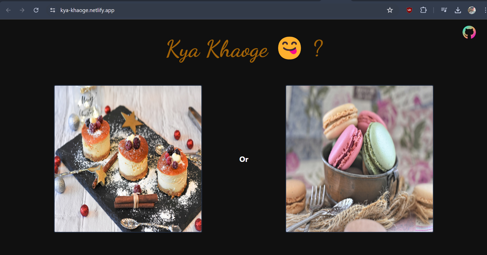

# Kya Kahoge 😋

I'm giving you a treat 🍕, you can have what you like.

It's live at (https://kya-khaoge.netlify.app/)

## About

Kya Kahoge is a simple web application designed to help you decide what to eat. The app features a straightforward user interface with two food images, allowing you to easily choose between two meal options.

## Screenshot

## Contribute

I welcome contributions to Kya Kahoge! If you find an issue or have an idea for a new feature.

If you find an issue, I would love to merge your fix! 🤗

## License

This project is licensed under the MIT License. See the [LICENSE](LICENSE) file for details.

## Contact

If you have any questions or feedback, feel free to reach out:

- **Email**: thearmaandeep@gmail.com
- **GitHub**: [iarmaansingh](https://github.com/iarmaansingh)
- **LinkedIn**: [Armaan Singh](https://www.linkedin.com/in/iarmaan/)

